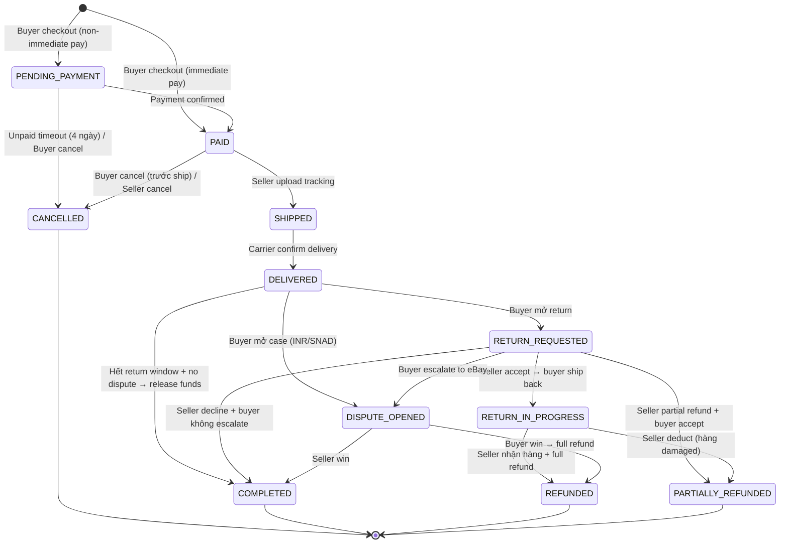

# 🔍 PHÂN TÍCH TOÀN DIỆN: Luồng Vận Hành Đơn Hàng eBay Thật vs File Nghiệp Vụ

---

## PHẦN A: LUỒNG HOÀN CHỈNH CỦA EBAY THẬT (TỪ ĐẦU ĐẾN CUỐI)

### A1. GIAI ĐOẠN 1 — BUYER CHECKOUT (Khởi tạo đơn hàng)

#### a) Buyer bấm "Buy It Now" (Fixed Price):
1. Buyer chọn quantity, variant → bấm **"Buy It Now"**
2. Nếu listing yêu cầu **Immediate Payment** → item **KHÔNG bị reserve** cho đến khi buyer pay xong. Listing vẫn available cho người khác.
3. Nếu KHÔNG yêu cầu Immediate Payment → item bị hold cho buyer, buyer có **4 ngày** để pay.
4. → Chuyển sang Checkout Page

#### b) Buyer bấm "Add to Cart":
1. Item được thêm vào Shopping Cart (chưa reserve stock)
2. Buyer có thể add nhiều items từ nhiều sellers
3. Items trong cart **CÓ THỂ bị người khác mua** trước khi checkout
4. Bấm "Go to Checkout" → chuyển sang Checkout Page

#### c) Buyer thắng Auction:
1. Auction kết thúc → eBay gửi email cho winning bidder
2. **Auto-payment**: Nếu buyer đã setup payment method khi bid → eBay **tự charge sau 1 giờ** (grace period để thay đổi shipping/payment)
3. Manual checkout: Buyer có thể checkout thủ công ngay
4. Deadline: **4 ngày** để pay, nếu không → seller có thể cancel + send **Second Chance Offer** cho bidder kế tiếp

#### d) Best Offer được Accept:
1. Buyer gửi offer (max **5 offers** cho 1 item)
2. Seller có **24 giờ** để: Accept / Decline / Counter-offer
3. Counter-offer: Buyer max **4 counters**, Seller max **5 counters**, mỗi counter expire sau **48h**
4. Auto-accept: Nếu offer ≥ AutoAcceptPrice → tự accept
5. Auto-decline: Nếu offer < AutoDeclinePrice → tự decline
6. Khi Accept → buyer **phải pay** (nếu autopay → charge ngay)
7. **Lưu ý**: item vẫn available cho người khác cho đến khi buyer hoàn tất payment (trừ khi autopay enabled)

#### e) Checkout Page — Các bước:
| Bước | Mô tả |
|------|--------|
| 1 | Review Order Details (items, qty, price) |
| 2 | Confirm/Change Shipping Address |
| 3 | Select Shipping Option (từ seller's shipping policy) |
| 4 | Select Payment Method (Credit Card / PayPal / Apple Pay / Google Pay) |
| 5 | Apply Coupon/Discount Code (nếu có) |
| 6 | Add Message to Seller (optional — shipping instructions) |
| 7 | **"Confirm and Pay"** → Payment processed |

#### f) Sau khi Payment thành công:
- Stock **trừ ngay** (quantity - purchased qty) trên listing
- Order được tạo với status = **Awaiting Shipment** (trên Seller Hub)
- Buyer thấy status = **"Paid"** / **"Payment confirmed"** trong Purchase History
- eBay gửi **email notification** cho cả buyer và seller
- Funds vào hệ thống eBay (KHÔNG vào seller ngay)

---

### A2. GIAI ĐOẠN 2 — SELLER FULFILLMENT (Xử lý đơn hàng)

#### Seller thấy đơn trong Seller Hub → Orders → "Awaiting Shipment"

**Tất cả actions seller có thể làm tại giai đoạn này:**

| # | Action | Mô tả chi tiết |
|---|--------|----------------|
| 1 | **Print Shipping Label** | Chọn carrier (USPS/UPS/FedEx), service, nhập weight/dimensions, pay → print. Tracking auto-upload. Bulk print tối đa **50 labels/lần** |
| 2 | **Add Tracking Manually** | Nếu ship bên ngoài eBay → nhập tracking # + carrier name |
| 3 | **Mark as Shipped** | Tự động khi upload tracking. Nếu không có tracking → manual mark |
| 4 | **Send Invoice** | Gửi invoice cho buyer (dùng khi combine shipping hoặc buyer chưa pay) |
| 5 | **Cancel Order** | Chọn reason → eBay auto refund. Reasons: Buyer asked, Out of stock (→ defect), Address issue, Buyer hasn't paid |
| 6 | **Message Buyer** | Chat trong context đơn hàng |
| 7 | **Refund Buyer** | Full refund hoặc Partial refund (max 90 ngày sau transaction) |
| 8 | **Combined Shipping** | Gộp nhiều đơn cùng buyer → 1 package, gửi revised invoice |

#### Ship-by Date:
- Tính từ **payment date + Handling Time** (từ Shipping Policy)
- VD: Handling 1 ngày → phải có carrier scan trong 1 business day
- **Trễ → Late Shipment** → ảnh hưởng seller metrics

#### Sau khi Upload Tracking:
- Order chuyển sang **"Shipped"** / **"Paid and Shipped"**
- eBay gửi email cho buyer kèm tracking #
- Buyer có thể track trên Purchase History

---

### A3. GIAI ĐOẠN 3 — IN TRANSIT & DELIVERY

| Status | Ai trigger | Mô tả |
|--------|-----------|--------|
| **Shipped** | Seller (upload tracking) | Hàng đã giao cho carrier |
| **In Transit** | Carrier (auto) | Carrier scan package tại depot |
| **Out for Delivery** | Carrier (auto) | Hàng đang được deliver |
| **Delivered** | **Carrier (auto)** | Carrier confirm delivery tại address |

> [!CAUTION]
> **Seller KHÔNG THỂ tự mark "Delivered"** — chỉ carrier tracking system confirm. Đây là rule chống gian lận quan trọng nhất.

#### Buyer actions tại giai đoạn In Transit:
| Action | Mô tả |
|--------|--------|
| Track Package | Xem tracking realtime |
| Contact Seller | Hỏi về shipping |
| Request Cancel | Chỉ được nếu seller **chưa mark shipped** (update 8/2024: buyer cancel bất kỳ lúc nào trước shipped) |

---

### A4. GIAI ĐOẠN 4 — POST-DELIVERY (Sau giao hàng)

#### Buyer actions sau khi nhận hàng:

| # | Action | Timeframe | Mô tả |
|---|--------|-----------|--------|
| 1 | **Leave Feedback** | 60 ngày từ delivery (hoặc 90 ngày từ purchase nếu chưa có delivery date) | Positive/Neutral/Negative + comment + photos + DSR ratings |
| 2 | **Request Return** | Theo seller's return policy (14/30/60 ngày) | Chọn reason → seller respond 3 ngày |
| 3 | **Report Item Not Received (INR)** | 30 ngày sau estimated delivery date | Nếu tracking không show delivered |
| 4 | **Report Not As Described (SNAD)** | Theo return policy | Hàng sai mô tả → Money Back Guarantee |
| 5 | **Contact Seller** | Bất kỳ lúc nào | Chat/message |
| 6 | **Hide Order** | 60 ngày | Ẩn khỏi Purchase History |

#### Seller actions sau delivery:

| # | Action | Mô tả |
|---|--------|--------|
| 1 | **Leave Feedback for Buyer** | Chỉ được positive |
| 2 | **Send Message to Buyer** | Follow-up, thank you |
| 3 | **View Payment Status** | Check khi nào funds available |
| 4 | **Issue Refund** | Full/Partial, max 90 ngày |

---

### A5. GIAI ĐOẠN 5 — RETURN/REFUND (Trả hàng/Hoàn tiền)

#### Luồng hoàn chỉnh:

```
Buyer bấm "Return this item" (Purchase History → More Actions)
  → Chọn Return Reason + Message + Photos
  → Seller nhận notification (eBay Messages + Email)
  → Seller có 3 BUSINESS DAYS để respond
  
  Seller responses:
  ├── Accept Return → eBay cung cấp return shipping label → Buyer ship back (15 ngày)
  │     → Seller nhận hàng → Inspect (2 ngày) → Issue Refund
  │     → Nếu seller không refund trong 2 ngày → eBay AUTO REFUND
  │
  ├── Offer Partial Refund → Buyer giữ hàng + nhận 1 phần tiền
  │     → Buyer accept hoặc reject (chỉ offer 1 LẦN)
  │     → Nếu reject → buyer có thể escalate lên eBay
  │
  ├── Full Refund (Buyer Keep Item) → Dùng cho hàng giá thấp
  │     → Buyer giữ hàng + full refund
  │
  ├── Send Replacement/Exchange → Gửi hàng mới thay thế
  │
  └── Decline Return → Chỉ nếu policy "No Returns" + buyer's remorse
        → NHƯNG: Money Back Guarantee override → nếu SNAD/Damaged → PHẢI accept

  Nếu không resolve:
  → Buyer hoặc Seller "Ask eBay to Step In" → eBay review (48h)
  → Nếu buyer win → Full refund + seller trả return shipping
  → Nếu seller win → Case closed, no refund
  → Appeal: 30 ngày sau close
```

#### Return Rules quan trọng:
| Rule | Chi tiết |
|------|----------|
| **Money Back Guarantee** | Dù "No Returns" policy → buyer vẫn return nếu SNAD/Damaged/Faulty |
| **Return Shipping Cost** | Seller's remorse (buyer đổi ý): theo policy (buyer-paid hoặc free). SNAD: **seller luôn trả** |
| **Free Returns Deduction** | Seller có thể trừ tối đa **50%** nếu hàng trả về bị used/damaged |
| **No Restocking Fee** | eBay **KHÔNG cho phép** charge restocking fee |
| **Auto Return Rules** | Seller có thể cài: auto-accept return + auto-refund cho items dưới $X |
| **Refund Processing** | 3-5 business days (có thể đến 30 ngày tùy payment method) |

#### Sau return → Stock Management:
- Hàng trả về → seller kiểm tra → nếu OK → **cộng lại vào stock**
- Nếu damaged → seller decide có bán lại hay không

---

### A6. GIAI ĐOẠN 6 — CANCELLATION (Hủy đơn — Luồng hoàn chỉnh)

#### 6a) Buyer Cancel Request:

```
Buyer → Purchase History → More Actions → "Cancel this order"
  → Chọn reason
  → eBay gửi request cho seller
  → Seller có 3 NGÀY để Accept / Decline
  → Nếu seller không respond trong 3 ngày → AUTO-DECLINE
  → Nếu Accept → eBay auto refund + auto relist item
  → Nếu Decline → buyer chờ hàng rồi return
```

**Rule quan trọng**: Buyer chỉ cancel được **TRƯỚC khi seller mark shipped** (update 8/2024)

#### 6b) Seller Cancel (Buyer không pay):

```
Buyer không pay
  → eBay gửi reminder tự động: 24h + 48h
  → Seller chờ 4 NGÀY
  → Seller → Orders → Cancel → Reason: "Buyer hasn't paid"
  → eBay auto cancel + remove buyer feedback + fee credit cho seller
  → Ghi "unpaid cancellation" lên buyer account
  → Buyer tích lũy quá nhiều → bị ban
```

**Auto-cancel Setting**: Seller có thể bật trong Selling Preferences → tự cancel sau 4+ ngày unpaid

#### 6c) Seller Cancel (Hết hàng):

```
Seller → Cancel → Reason: "Out of stock or can't find item"
  → eBay auto refund buyer
  → ⚠️ Seller bị GHI 1 TRANSACTION DEFECT
  → Ảnh hưởng seller level: defect rate > 2% → Below Standard
```

#### 6d) Second Chance Offer (cho Auction):

```
Sau khi cancel (buyer không pay hoặc buyer cancel):
  → Seller → More Actions → "Second Chance Offer"
  → Chọn bidder kế tiếp → set duration (1/3/5/7 ngày)
  → eBay gửi email offer → bidder accept/decline
  → Nếu decline → offer bidder tiếp theo
  → Free cho seller, final value fee chỉ charge nếu accept
  → Có hiệu lực đến 60 ngày sau auction kết thúc
```

#### Cancel Reasons & Impact:

| Reason | Impact lên Seller | Impact lên Buyer |
|--------|-------------------|------------------|
| Buyer asked to cancel | ✅ Không ảnh hưởng | Ghi cancel lên account |
| Buyer hasn't paid | ✅ Fee credit | ⚠️ Unpaid strike |
| Out of stock | ❌ **Transaction Defect** | N/A |
| Problem with buyer's address | ✅ Không ảnh hưởng | N/A |

---

### A7. GIAI ĐOẠN 7 — DISPUTE/CASE (Khiếu nại)

```
Buyer mở Case (Purchase History → "I didn't receive my item" hoặc "Item not as described")
  → Step 1: Contact Seller (seller có 3 business days để respond)
  → Step 2: Nếu không resolve → "Ask eBay to Step In"
  → Step 3: eBay review (thường 48h, có thể lâu hơn)
  
  Kết quả:
  ├── Buyer win → Full refund (item + original shipping cost)
  │     → Seller bị 1 TRANSACTION DEFECT
  │     → Funds bị FROZEN trong thời gian dispute
  │
  └── Seller win → Case closed, no refund
        → Buyer có thể appeal trong 30 ngày

  Types:
  ├── INR (Item Not Received): Buyer báo trong 30 ngày sau estimated delivery
  └── SNAD (Significantly Not As Described): Hàng sai mô tả
```

---

### A8. GIAI ĐOẠN 8 — FINANCE/PAYOUT (Tiền)

#### Luồng tiền hoàn chỉnh:

```
Buyer pay $100
  → Funds vào eBay (KHÔNG vào seller ngay)
  → Status: "Processing" / "On hold"
  
  Điều kiện release:
  ├── Seller có uy tín (established) → funds available sau 2 NGÀY kể từ payment confirmed
  ├── Seller mới (new/infrequent) → hold 21-30 NGÀY cho đến delivery confirmed
  ├── High-value items → hold 30 ngày
  └── Untracked shipping → hold 31 ngày

  Khi funds available:
  → eBay trừ phí: Final Value Fee (~13.25%) + Per-Order Fee ($0.30)
  → VD: $100 - $13.25 - $0.30 = $86.45 available
  
  Payout Schedule (seller chọn):
  ├── Daily (Thứ 2-CN, phí $1/payout)
  ├── Weekly (mỗi thứ 3)
  ├── Bi-weekly (mỗi 2 tuần)
  └── Monthly (thứ 3 đầu tháng)
  
  On-demand Payout: seller rút sớm (express qua debit card: 30 phút, có phí)
  
  Funds → Bank account: 1-3 business days sau khi payout initiated
```

---

### A9. SELLER PERFORMANCE METRICS (Liên quan đến Order)

| Metric | Standard | Top Rated | Below Standard |
|--------|----------|-----------|----------------|
| **Transaction Defect Rate** | ≤ 2% | ≤ 0.5% | > 2% (with 4+ buyers) |
| **Late Shipment Rate** | No minimum | ≤ 3% (or ≤ 5 late) | N/A (alone) |
| **Tracking Upload** | N/A | ≥ 95% within handling time | N/A |
| **Handling Time** | As stated in policy | Same-day or 1-day for Top Rated Plus | N/A |

**Defect sources from orders:**
- Cancel vì out of stock
- INR case closed without resolution
- SNAD case closed without resolution
- Late shipment (không trực tiếp cause Below Standard nhưng affect Top Rated)

---

### A10. NOTIFICATIONS (Cả Buyer và Seller)

| Event | Buyer nhận | Seller nhận |
|-------|-----------|-------------|
| Order placed | ✅ Email + App | ✅ Email + App ("cha-ching" sound) |
| Payment confirmed | ✅ | ✅ |
| Shipped (tracking uploaded) | ✅ Email kèm tracking | ✅ |
| Delivered | ✅ | ✅ |
| Cancel request | ✅ | ✅ |
| Return request | ✅ | ✅ |
| Case opened | ✅ | ✅ |
| Refund issued | ✅ | ✅ |
| Payment reminder (unpaid) | ✅ (24h + 48h auto) | N/A |
| eBay stepped in | ✅ | ✅ |
| Funds available | N/A | ✅ |

---

## PHẦN B: SO SÁNH VỚI FILE NGHIỆP VỤ PHẦN 3

### B1. Bảng So Sánh Tổng Thể

| Khía cạnh | eBay Thật | File Nghiệp Vụ | Gap |
|-----------|-----------|-----------------|-----|
| **Order Status** | Payment Status + Fulfillment Status + Cancel Status (3 chiều) | 1 chiều đơn giản (PENDING → PAID → READY_TO_SHIP → SHIPPED → DELIVERED) | 🔴 |
| **Stock Reservation** | Trừ ngay khi pay (1 bước). Immediate Payment = KHÔNG reserve trước pay | 2 bước (ReservedQuantity + Quantity) | 🟡 |
| **Checkout → Order** | Buy It Now / Cart / Auction / Best Offer → Checkout Page (7 bước) | "Buyer bấm Thanh toán" (1 câu) | 🟡 |
| **Fulfillment** | Paid → Ship (print label/add tracking) → Delivered (carrier) | PAID → READY_TO_SHIP → SHIPPED → DELIVERED | 🟡 |
| **Cancellation** | Buyer cancel (trước ship), seller cancel (4 reasons), auto-cancel unpaid, second chance offer | 1 dòng: "Khách không thanh toán quá hạn" | 🔴 |
| **Return/Refund** | Full workflow (accept/partial/replacement/decline, 15 ngày return, 2 ngày inspect, auto-refund) | **HOÀN TOÀN THIẾU trong PHẦN 3** | 🔴 |
| **Dispute/Case** | INR 30 ngày, SNAD, escalate to eBay, 48h review, appeal 30 ngày | Nhắc thoáng ở PHẦN 6 | 🔴 |
| **Finance/Payout** | Complex: fund hold (2-30 ngày tùy seller), payout schedule (daily/weekly/monthly), fee ~13.55% | Đơn giản: PendingBalance, 3-7 ngày, 5% fee | 🟡 |
| **Combined Shipping** | Gộp đơn cùng buyer, revised invoice, auto/manual combine | Thiếu hoàn toàn | 🟡 |
| **Partial Shipment** | Ship nhiều đợt, status IN_PROGRESS | Thiếu | 🟡 |
| **Performance Impact** | Transaction defect, late shipment rate → seller level | Nhắc ở PHẦN 7 nhưng không link rõ | 🟡 |
| **Notifications** | Email + App + SMS cho mọi event | Thiếu hoàn toàn | 🔵 |
| **Best Offer → Order** | 5 offers, 24h respond, counter-offers, auto-accept/decline | Nhắc ở PHẦN 2 nhưng không nối vào order flow | 🟡 |
| **Auction → Order** | Auto-pay 1h, 4 ngày deadline, Second Chance Offer | Thiếu hoàn toàn | 🔵 |
| **Shipping Label** | Tích hợp mua label, chọn carrier/service, discounted rates | "Sinh mã Tracking giả lập" | 🔵 |
| **Delivered Verification** | Carrier tracking auto-confirm | Không nói rõ AI confirm | 🔴 |

---

### B2. DANH SÁCH KHUYẾT ĐIỂM CHI TIẾT (27 items)

#### 🔴 CRITICAL — Phải sửa (8 items)

| # | Vấn đề | Chi tiết |
|---|--------|---------|
| 1 | **Return/Refund flow hoàn toàn thiếu** | eBay có luồng phức tạp: buyer request → seller respond 3 ngày → 5 options (accept/partial/full refund keep item/replacement/decline) → buyer ship back 15 ngày → seller inspect 2 ngày → refund hoặc eBay auto-refund. File nghiệp vụ PHẦN 3 **không có từ nào về return** |
| 2 | **Cancellation flow quá sơ sài** | Chỉ 1 dòng vs hệ thống: buyer cancel request → seller 3 ngày accept/decline → auto-decline timeout → 4 reasons → fee credit → auto-relist → feedback protection |
| 3 | **Thiếu CANCELLED status** | Không define trong status lifecycle. eBay có cả hệ thống Cancel Status riêng (CANCEL_REQUESTED, CANCEL_PENDING, CANCEL_CLOSED) |
| 4 | **DELIVERED phải do carrier confirm** | File nghiệp vụ ghi "Khách nhận hàng" nhưng không nói rõ carrier auto-confirm. Nếu để seller tự mark → **gian lận nghiêm trọng** (mark delivered để nhận tiền dù chưa ship) |
| 5 | **Thiếu Cancel Reasons bắt buộc** | eBay bắt buộc chọn lý do: Buyer asked / Hasn't paid / Out of stock / Address issue. Mỗi reason có impact khác nhau lên metrics |
| 6 | **Thiếu Money Back Guarantee** | eBay override tất cả return policy nếu item SNAD/Damaged. File nghiệp vụ không có concept này |
| 7 | **Thiếu Dispute Escalation** | Buyer → Seller 3 ngày → Escalate to eBay → 48h review → Appeal 30 ngày. Hoàn toàn thiếu |
| 8 | **Thiếu luồng Unpaid Item tự động** | Không define: timeout bao lâu, auto-cancel, reminder 24h/48h, ghi strike lên buyer, Second Chance Offer cho auction |

#### 🟡 IMPORTANT — Nên sửa (10 items)

| # | Vấn đề | Chi tiết |
|---|--------|---------|
| 9 | **READY_TO_SHIP là trạng thái thừa** | eBay KHÔNG có. Paid → seller ship → Shipped (tracking upload). READY_TO_SHIP tăng complexity mà không rõ business value |
| 10 | **ReservedQuantity 2 bước phức tạp** | eBay trừ stock 1 bước khi pay. Cơ chế 2 bước tạo race condition, phantom stock, mọi logic đều phải handle 2 fields |
| 11 | **Thiếu Ship-by Date** | eBay tính: Payment Date + Handling Time = Ship-by deadline. Seller ship trễ → Late Shipment defect. File nghiệp vụ không track |
| 12 | **Thiếu Combined Shipping** | eBay: gộp đơn cùng buyer, revised invoice, combine tối đa 100 items, configurable window 3-30 ngày |
| 13 | **Thiếu Partial Shipment** | eBay: order nhiều items → ship nhiều đợt → status IN_PROGRESS. File nghiệp vụ không support |
| 14 | **Thiếu Auto-cancel unpaid** | eBay: seller bật auto-cancel trong Selling Preferences, tự cancel sau 4+ ngày. File nghiệp vụ không có |
| 15 | **Thiếu Payment Hold cho seller mới** | eBay: hold 21-30 ngày cho new/infrequent sellers. File nghiệp vụ xử lý tất cả seller như nhau |
| 16 | **Immediate Payment vs Non-immediate** | eBay có 2 mode: immediate (KHÔNG reserve stock, item available cho mọi người) vs non-immediate (hold cho buyer). File nghiệp vụ chỉ có 1 mode |
| 17 | **Thiếu Cancel → Stock restore** | Khi cancel → stock phải +1 trở lại. File nghiệp vụ chỉ ghi "xả kho" rất mơ hồ cho reservation nhưng **không nói gì cho stock** nếu đã deduct (PAID) |
| 18 | **Checkout → Order creation thiếu chi tiết** | File nghiệp vụ ghi "Buyer bấm Thanh toán" nhưng không mô tả: shipping address verification, payment method selection, coupon application, message to seller |

#### 🔵 NICE-TO-HAVE — Cho MVP nâng cao (9 items)

| # | Vấn đề |
|---|--------|
| 19 | Thiếu Bulk Actions (bulk print labels, update tracking 50/lần) |
| 20 | Thiếu Shipping Label integration (mua label qua platform, discounted rates) |
| 21 | Thiếu Payout Schedule linh hoạt (daily/weekly/monthly) |
| 22 | Thiếu Order Timeline/History (log events chi tiết searchable) |
| 23 | Thiếu Buyer-Seller Messaging in context đơn hàng |
| 24 | Thiếu Fee Breakdown per order (Final Value Fee chi tiết) |
| 25 | Thiếu Auto-relist sau cancel |
| 26 | Thiếu Automated Return Rules (auto-accept return dưới $X) |
| 27 | Thiếu Second Chance Offer (cho Auction) |

---

### B3. ĐỀ XUẤT ORDER STATUS LIFECYCLE ĐẦY ĐỦ



---

### B4. MÀN HÌNH CẦN BUILD (SELLER HUB → ORDERS)

#### Screens chính:

| # | Screen | Components |
|---|--------|-----------|
| 1 | **Orders List** | Tabs (All/Awaiting Payment/Awaiting Shipment/Shipped/Cancellations/Returns), filters (date/buyer/status/orderID), order cards, bulk action bar |
| 2 | **Order Detail** | Order summary, item list, buyer info, shipping section (carrier/tracking/ship-by date), payment section (amount/fees/net), order timeline, action buttons |
| 3 | **Cancel Order Dialog** | Reason selection, impact warning, confirm button |
| 4 | **Return Management** | Returns list, return detail (reason/photos/timeline), response actions (accept/partial/decline) |
| 5 | **Refund Dialog** | Full/Partial toggle, amount input, reason, confirm |
| 6 | **Shipping Label** | Carrier select, service select, weight/dimensions, cost preview, pay & print |

---

## PHẦN C: GHI CHÚ PERFORMANCE / BẢO MẬT / SCALABILITY

> [!TIP]
> ### Performance
> - **Stock deduction**: Dùng `UPDATE ... SET Qty = Qty - @qty WHERE Qty >= @qty` (1 atomic query, pessimistic lock) — KHÔNG SELECT rồi UPDATE
> - **Order listing queries**: Index trên `(ShopId, Status, CreatedAt DESC)` — mọi tab đều filter theo status
> - **Tab counts**: Cache đếm số đơn per tab (Redis/Memory) thay vì COUNT(*) mỗi request
> - **Order Detail**: Eager load OrderItems + Tracking + Payments trong 1 query (tránh N+1)

> [!TIP]
> ### Bảo mật
> - **Authorization**: Mọi order query **PHẢI** filter theo ShopId/BuyerId — seller A KHÔNG BAO GIỜ thấy đơn của seller B
> - **Status transition validation**: State machine pattern — chỉ cho phép transitions hợp lệ (VD: SHIPPED → DELIVERED chỉ system/carrier, KHÔNG phải seller)
> - **PII Protection**: Buyer address, phone → encrypt at rest, chỉ display khi seller cần ship
> - **Idempotency**: Cancel/Refund API phải idempotent (dùng idempotency key) — chống double refund
> - **Rate Limiting**: Cancel/Refund endpoints cần rate limit chặt (chống abuse)

> [!TIP]
> ### Scalability
> - **Event-driven**: OrderStatusChanged event → consumers xử lý (Stock, Finance, Notification, Analytics) — loose coupling
> - **Outbox Pattern**: DB update + Event publish phải atomic (tránh lost events)
> - **CQRS**: Tách read model (order listing, search) vs write model (state machine) — read có thể scale riêng
> - **Saga Pattern**: Order flow spans nhiều bounded contexts (Inventory, Payment, Shipping) → dùng Saga cho distributed transactions
